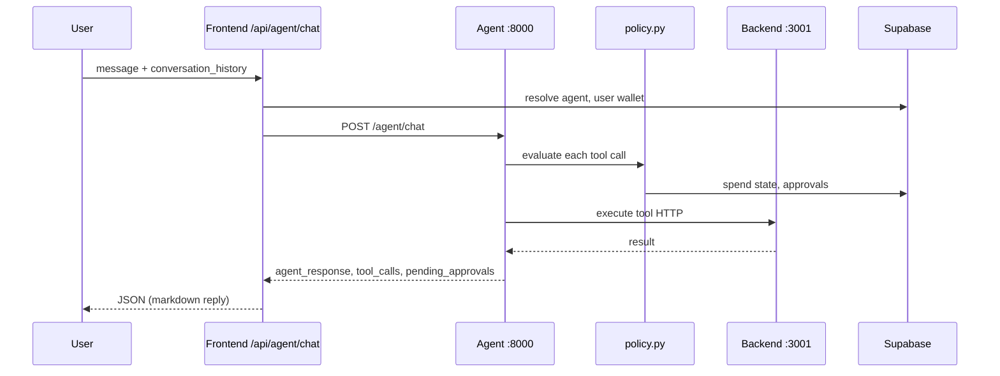

# Monad No-Code Agent Builder

## Introduction

**Monad No-Code Agent Builder** is a no-code platform for building, deploying, and chatting with **AI-powered agents** that perform real actions on **Monad Testnet**

Users compose agents visually (drag-and-drop), from **quick-start templates**, or via **natural-language AI workflow generation**. Each tool node can carry **per-node guardrails** (budgets, allowlists, approvals). Agents are saved to **Supabase**, exposed via **API keys**, and chatted with in a rich UI or external HTTP clients.

### What problem it solves

Building on-chain agents today usually means wiring LLMs, wallets, RPCs, and safety limits yourself. This project provides:

- A **visual workflow builder** and **AI workflow generator**
- A **unified tool registry** (18 tools across chain, trading, and commerce)
- A **policy engine** with human-in-the-loop checkout approval
- **Server-side signing** (no private keys in the LLM)
- **Audit logs**, **spend sessions**, and **approval queues** in Supabase

### Tool count

| Category | Tools |
|----------|-------|
| Chain read/write | 8 |
| Trading read/write | 4 |
| Commerce read/write | 5 |
| **Total** | **18** |

---

## Resources

| Resource | Link |
|----------|------|
| Pitch Deck | [View](https://canva.link/pt14mcr8gb3eeu1) |
| Demo Video | [View](https://www.youtube.com/watch?v=3-eC7cXLDaI) |
| Live Demo | [https://monad-agent-builder.vercel.app](https://monad-agent-builder.vercel.app) |

### Deployed contracts (Monad Testnet)

Deploy with `backend/scripts/deploy-monad.sh`, then set addresses in `backend/.env`.

| Contract | Address | Explorer |
|----------|---------|----------|
| TokenFactory | `0x26D215752f68bc2254186F9f6FF068b8C4BdFd37` | [View](https://testnet.monadvision.com/address/0x26D215752f68bc2254186F9f6FF068b8C4BdFd37) |
| NFTFactory | `0x3EA6D1c84481f89aac255a7ABC375fe761653cdA` | [View](https://testnet.monadvision.com/address/0x3EA6D1c84481f89aac255a7ABC375fe761653cdA) |
| DAOFactory | `0x1E491de1a08843079AAb4cFA516C717597344e50` | [View](https://testnet.monadvision.com/address/0x1E491de1a08843079AAb4cFA516C717597344e50) |
| Airdrop | `0x14d42947929F1ECf882aA6a07dd4279ADb49345d` | [View](https://testnet.monadvision.com/address/0x14d42947929F1ECf882aA6a07dd4279ADb49345d) |
| YieldCalculator | `0xC6Ffc4E56388fFa99EA18503a0Ea518e795ceCC8` | [View](https://testnet.monadvision.com/address/0xC6Ffc4E56388fFa99EA18503a0Ea518e795ceCC8) |

### Factory deployment transactions

| Contract | Deployment tx |
|----------|---------------|
| TokenFactory | [0xe024…318b6](https://testnet.monadvision.com/tx/0xe024d541f33648c84f4de4310e85dab3c8f5e55a17c4c445ea4175eb7e8318b6) |
| NFTFactory | [0x4cc4…2a7c](https://testnet.monadvision.com/tx/0x4cc43c1ca534fb3b2e2f16301df9490b0e4bd87b9d48016bffd072d5b0c52a7c) |
| DAOFactory | [0xab34…1e75](https://testnet.monadvision.com/tx/0xab341addb15bbac91c3205fe59153a948601f04c3512e84ecc04e4331e481e75) |
| Airdrop | [0xe1a1…2eb6](https://testnet.monadvision.com/tx/0xe1a10d0edfd39e996ad0609a680beb00d48a1da7180d22d671ccc5035bb52eb6) |
| YieldCalculator | [0xf5dd…36d6](https://testnet.monadvision.com/tx/0xf5ddc9bd97983efe6ac3ef6f7882de4a7a794c94ec7f36cb262bd106948336d6) |

### Verified agent tool transactions (Monad Testnet)

These txs were executed through the agent → backend tool pipeline (wallet signing server-side). Read-only and commerce tools have no on-chain tx.

| Tool | Verified tx | Notes |
|------|-------------|-------|
| `transfer` | [0x0e2b…565c](https://testnet.monadvision.com/tx/0x0e2b455f1ae8df816541ca49925970ce3c9609ce6bf41e05cfb282f43d7a565c) | Native/token transfer |
| `deploy_erc20` | [0xe137…6f21](https://testnet.monadvision.com/tx/0xe137b01956ee7c5de603964ec888269908fc9d9640a593329773f507ce8e6f21) | Via [TokenFactory.createToken](https://github.com/SamFelix03/monad-agent-builder/blob/main/backend/ERC-20/TokenFactory.sol#L48) |
| `deploy_erc721` | [0x2a89…7fc2](https://testnet.monadvision.com/tx/0x2a899d692269d2301e7b159a8d2307eb76de37568f374ed8f0ec47f8c7187fc2) | Via [NFTFactory.createCollection](https://github.com/SamFelix03/monad-agent-builder/blob/main/backend/ERC-721/NFTFactory.sol#L48) |
| `create_dao` | [0x5a17…f892](https://testnet.monadvision.com/tx/0x5a1763361f644c190af3613846f7ea3a03457ffe23d86133c5754c3bd5bff892) | Via [DAOFactory.createDAO](https://github.com/SamFelix03/monad-agent-builder/blob/main/backend/DAO/DAO.sol#L195) |
| `airdrop` | [0x6306…b532](https://testnet.monadvision.com/tx/0x6306bec4833af8ee205a4a9caee5b836908a89a1634021811c26678c5632b532) | Via [Airdrop.airdrop](https://github.com/SamFelix03/monad-agent-builder/blob/main/backend/Air%20Drop/Airdrop.sol#L55) |
| `deposit_yield` | [0x469b…bc3a](https://testnet.monadvision.com/tx/0x469b9c79a4e67a7ac6507ed50d3b36a31090552610c21974ec1342cb877bbc3a) | Via [YieldCalculator.createDeposit](https://github.com/SamFelix03/monad-agent-builder/blob/main/backend/Yield/YieldCalculator.sol#L44) |
| `swap` | [0x9a30…b3e7](https://testnet.monadvision.com/tx/0x9a301e8f76b157da39c2d74e7362cad4f2b0e1e00e4dbdd9d951f69218c6b3e7) | Kuru Flow swap |
| `fetch_price` | — | Read-only API ([main.js#L2047](https://github.com/SamFelix03/monad-agent-builder/blob/main/backend/main.js#L2047)) |
| `get_balance` / `wallet_analytics` | — | Read-only API ([main.js#L2128](https://github.com/SamFelix03/monad-agent-builder/blob/main/backend/main.js#L2128)) |
| `quote_swap` / `get_portfolio` / `get_trade_history` | — | Read-only API ([extensions.js](https://github.com/SamFelix03/monad-agent-builder/blob/main/backend/routes/extensions.js)) |
| Commerce tools (`product_search` … `place_order`) | — | Off-chain mock ([commerce/mock.js](https://github.com/SamFelix03/monad-agent-builder/blob/main/backend/commerce/mock.js)) |

---

## How to Use

1. Visit [https://monad-agent-builder.vercel.app](https://monad-agent-builder.vercel.app)
2. Sign in with Google (Privy)
3. Create or import an **agent wallet** ([`frontend/components/agent-wallet.tsx`](https://github.com/SamFelix03/monad-agent-builder/blob/main/frontend/components/agent-wallet.tsx))
4. Open **Agent Builder** — drag tools, pick a **Quick start template**, or use **Create with AI**
5. Configure **per-node policies** in the node config panel
6. **Save** the agent (stored in Supabase `agents` table)
7. **Chat** with the agent in the UI or via API key

---

## Table of Contents

1. [Platform Architecture](#platform-architecture)
2. [Agent Templates (Quick Start)](#agent-templates-quick-start)
3. [Policy Engine & Guardrails](#policy-engine--guardrails)
4. [Commerce & Mock Shopping](#commerce--mock-shopping)
5. [Chat Experience](#chat-experience)
6. [Unified Tool Registry — All 18 Tools](#unified-tool-registry--all-18-tools)
7. [System Components](#system-components)
8. [API Surface](#api-surface)
9. [Supabase Extensions](#supabase-extensions)
10. [Local Development](#local-development)
11. [Production Deployment](#production-deployment)
12. [Environment Variables](#environment-variables)
13. [Smart Contracts](#smart-contracts)
14. [Key Source Files](#key-source-files)

> **Verified txs & source links:** see [Resources → Verified agent tool transactions](#verified-agent-tool-transactions-monad-testnet) and [Source code links](#source-code-links).

---

## Platform Architecture

```mermaid
graph TB
    subgraph Browser
        UI[Next.js Frontend<br/>Vercel :3000]
    end

    subgraph Vercel_API[Next.js API Routes BFF]
        ChatRoute[/api/agent/chat]
        WorkflowRoute[/api/create-workflow]
        BackendProxy[sessions · approvals · commerce]
    end

    subgraph Railway
        Agent[Agent Service<br/>FastAPI + Groq :8000]
        Backend[Backend API<br/>Express :3001]
        WB[Workflow Builder<br/>FastAPI + Groq :8001]
    end

    subgraph Data
        Supabase[(Supabase<br/>agents · users · approvals · sessions · audit)]
    end

    subgraph Monad[Monad Testnet + APIs]
        Contracts[Factory Contracts]
        Kuru[Kuru Flow Swaps]
        Moralis[Moralis Analytics]
    end

    UI --> Vercel_API
    ChatRoute --> Agent
    WorkflowRoute --> WB
    BackendProxy --> Backend
    Agent -->|BACKEND_BASE_URL tools| Backend
    Agent --> Supabase
    Backend --> Supabase
    Backend --> Contracts
    Backend --> Kuru
    Backend --> Moralis
    UI --> Supabase
```

### Request flow (chat)



### Service ports (local)

| Service | Port | Entry |
|---------|------|-------|
| Frontend | 3000 | `frontend/` → `npm run dev` |
| Backend | 3001 | `backend/` → `node main.js` |
| Agent | 8000 | `agent/` → `uvicorn main:app --port 8000` |
| Workflow Builder | 8001 | `WorkflowBuilder/` → `uvicorn main:app --port 8001` |

---

## Agent Templates (Quick Start)

Templates live in [`shared/tools/registry.json`](https://github.com/SamFelix03/monad-agent-builder/blob/main/shared/tools/registry.json#L30-L70) (`templates` object) and are rendered in the workflow library sidebar via [`frontend/components/template-library-section.tsx`](https://github.com/SamFelix03/monad-agent-builder/blob/main/frontend/components/template-library-section.tsx). Applying a template auto-chains tools and **per-step policies**.

| Template ID | Label | Agent type | Description | Tool chain |
|-------------|-------|------------|-------------|------------|
| `portfolio_watcher` | Portfolio Watcher | `trading` | Read-only portfolio and price monitoring | `get_portfolio` → `fetch_price` → `wallet_analytics` |
| `cautious_trader` | Cautious Trader | `trading` | Quote-first swaps with spending caps | `get_portfolio` → `quote_swap` → `swap` |
| `shopping_researcher` | Shopping Researcher | `shopping` | Search and compare products (no checkout) | `product_search` → `product_details` |
| `guarded_shopper` | Guarded Shopper | `shopping` | Full shopping flow with approval + caps | `product_search` → `build_cart` → `checkout_quote` → `place_order` |

### Template definitions (registry)

```json
// shared/tools/registry.json L30-70
"templates": {
  "portfolio_watcher": { "label": "Portfolio Watcher", "agent_type": "trading", ... },
  "cautious_trader": { "label": "Cautious Trader", ... },
  "shopping_researcher": { "label": "Shopping Researcher", "agent_type": "shopping", ... },
  "guarded_shopper": { "label": "Guarded Shopper", ... }
}
```

### Per-template default policies (highlights)

| Template | Notable policies |
|----------|------------------|
| Portfolio Watcher | `read_only: true` on all nodes |
| Cautious Trader | `max_trade_notional_usd: 25`, `daily_spend_budget_usd: 100`, `require_quote_before_swap` |
| Shopping Researcher | `merchant_allowlist: ["mock"]` |
| Guarded Shopper | `max_order_usd: 50`, `daily_shopping_budget_usd: 200`, `require_approval_for_checkout: true` |

Template → canvas conversion: [`frontend/lib/template-builder.ts`](https://github.com/SamFelix03/monad-agent-builder/blob/main/frontend/lib/template-builder.ts)  
AI natural-language alternative: [`WorkflowBuilder/main.py`](https://github.com/SamFelix03/monad-agent-builder/blob/main/WorkflowBuilder/main.py#L92) → `POST /create-workflow`

---

## Policy Engine & Guardrails

Policies are configured **per tool node** in the workflow builder ([`frontend/components/node-config-panel.tsx`](https://github.com/SamFelix03/monad-agent-builder/blob/main/frontend/components/node-config-panel.tsx)) and aggregated at runtime by [`agent/policy.py`](https://github.com/SamFelix03/monad-agent-builder/blob/main/agent/policy.py#L133) and [`frontend/lib/policies.ts`](https://github.com/SamFelix03/monad-agent-builder/blob/main/frontend/lib/policies.ts).

### Policy fields by category

| Field | Trading | Shopping | Description |
|-------|---------|----------|-------------|
| `max_trade_notional_usd` | ✓ | | Max single swap notional |
| `daily_spend_budget_usd` | ✓ | | Daily trading spend cap |
| `approval_threshold_usd` | ✓ | | Trades above this need approval |
| `max_slippage_bps` | ✓ | | Max slippage in basis points |
| `cooldown_seconds` | ✓ | | Min seconds between swaps |
| `allowed_tokens` | ✓ | | Token allowlist |
| `require_quote_before_swap` | ✓ | | Enforce quote before swap |
| `max_order_usd` | | ✓ | Max single order total |
| `daily_shopping_budget_usd` | | ✓ | Daily **completed purchase** cap |
| `merchant_allowlist` | | ✓ | Allowed commerce providers |
| `require_approval_for_checkout` | | ✓ | Human approval before `place_order` |
| `read_only` | ✓ | ✓ | Block all writes |

Policy UI field definitions: [`frontend/lib/policies.ts` L13–44](https://github.com/SamFelix03/monad-agent-builder/blob/main/frontend/lib/policies.ts#L13-L44)  
Policy evaluation engine: [`agent/policy.py` L318–394](https://github.com/SamFelix03/monad-agent-builder/blob/main/agent/policy.py#L318-L394) (`_check_shopping_budget`, `_evaluate_commerce_write`)  
Default policy presets: [`shared/tools/registry.json` L10–28](https://github.com/SamFelix03/monad-agent-builder/blob/main/shared/tools/registry.json#L10-L28)

### Human-in-the-loop approvals

When `place_order` is blocked by policy:

1. Agent creates a row in Supabase `agent_approvals` ([`agent/db.py` → `create_approval`](https://github.com/SamFelix03/monad-agent-builder/blob/main/agent/db.py#L156))
2. Chat UI shows **Pending Approval** card with **Approve & checkout** ([`frontend/app/agent/[agentId]/chat/page.tsx`](https://github.com/SamFelix03/monad-agent-builder/blob/main/frontend/app/agent/%5BagentId%5D/chat/page.tsx))
3. User approves → `POST /api/agent/approvals/:id/resolve` → backend → Supabase ([`frontend/app/api/agent/approvals/[id]/resolve/route.ts`](https://github.com/SamFelix03/monad-agent-builder/blob/main/frontend/app/api/agent/approvals/%5Bid%5D/resolve/route.ts))
4. Agent retries `place_order` with `approvalId` + `cartId`

Typing `confirm` / `approve` in chat also resolves the latest pending approval (`CONFIRM_RE` in chat page).

### Shopping spend sessions

For shopping agents, users can create a **session budget** in chat (e.g. $50). Stored in `agent_sessions` via `POST /agents/:agentId/sessions` ([`backend/routes/extensions.js` L301](https://github.com/SamFelix03/monad-agent-builder/blob/main/backend/routes/extensions.js#L301)).

---

## Commerce & Mock Shopping

Mock catalog and cart logic: [`backend/commerce/mock.js`](https://github.com/SamFelix03/monad-agent-builder/blob/main/backend/commerce/mock.js)  
Provider registry: [`backend/commerce/registry.js`](https://github.com/SamFelix03/monad-agent-builder/blob/main/backend/commerce/registry.js)  
Commerce routes: [`backend/routes/extensions.js` L333–470](https://github.com/SamFelix03/monad-agent-builder/blob/main/backend/routes/extensions.js#L333-L470)

### Mock catalog (sample products)

| ID | Product | Price |
|----|---------|-------|
| mock-001 | Wireless Bluetooth Headphones | $49.99 |
| mock-002 | Mechanical Keyboard | $89.99 |
| mock-003 | USB-C Hub 7-in-1 | $34.99 |
| mock-004 | Standing Desk Mat | $29.99 |
| mock-005 | Programmable Coffee Maker | $59.99 |

### Price-aware search

`product_search` supports:

- `maxPriceUsd` / `minPriceUsd` parameters
- Natural language in query: *"products under $50"*

Parser: [`backend/commerce/mock.js` `extractPriceFilters`](https://github.com/SamFelix03/monad-agent-builder/blob/main/backend/commerce/mock.js#L53)  
Agent prompt rules: [`agent/main.py` L101–110](https://github.com/SamFelix03/monad-agent-builder/blob/main/agent/main.py#L101-L110) (SHOPPING RULES)

### Shopping flow

```
product_search → product_details (optional) → build_cart → checkout_quote
  → [user approval] → place_order
```

Auto-chaining stops before `build_cart` / `checkout_quote` / `place_order` unless the user explicitly wants to buy ([`agent/main.py` `NO_AUTO_CHAIN_TOOLS` L159](https://github.com/SamFelix03/monad-agent-builder/blob/main/agent/main.py#L159)).

### Commerce API endpoints

| Method | Path | Purpose |
|--------|------|---------|
| GET | `/commerce/providers` | List providers |
| POST | `/commerce/search` | Product search |
| POST | `/commerce/product` | Product details |
| POST | `/commerce/cart` | Build cart |
| POST | `/commerce/checkout-quote` | Tax + shipping quote |
| POST | `/commerce/place-order` | Place order (needs `approvalId` when guarded) |
| GET | `/commerce/cart/:cartId` | Get cart |

---

## Chat Experience

Implemented in [`frontend/app/agent/[agentId]/chat/page.tsx`](https://github.com/SamFelix03/monad-agent-builder/blob/main/frontend/app/agent/%5BagentId%5D/chat/page.tsx) and [`frontend/components/agent-markdown.tsx`](https://github.com/SamFelix03/monad-agent-builder/blob/main/frontend/components/agent-markdown.tsx).

| Feature | Implementation |
|---------|----------------|
| **Session context** | Last 40 user/assistant messages sent as `conversation_history` ([`agent/main.py` `_build_llm_messages`](https://github.com/SamFelix03/monad-agent-builder/blob/main/agent/main.py#L164)) |
| **Markdown replies** | `AgentMarkdown` component (react-markdown + remark-gfm + rehype-sanitize) |
| **Collapsed tool logs** | Tool calls + execution results in collapsible "Technical details" |
| **Visible approvals** | Pending approval cards stay expanded with Approve/Reject buttons |
| **Shopping session bar** | Budget display + "New session" (`handleCreateShoppingSession`) |
| **Text confirmation** | `yes` / `confirm` / `approve` triggers approval resolve |

Agent response synthesis when LLM returns empty content: [`agent/main.py` `_synthesize_agent_response`](https://github.com/SamFelix03/monad-agent-builder/blob/main/agent/main.py#L517)  
Chat BFF proxy: [`frontend/app/api/agent/chat/route.ts`](https://github.com/SamFelix03/monad-agent-builder/blob/main/frontend/app/api/agent/chat/route.ts)

---

## Unified Tool Registry — All 18 Tools

Canonical registry: **[`shared/tools/registry.json`](https://github.com/SamFelix03/monad-agent-builder/blob/main/shared/tools/registry.json)**  
Runtime loader (agent): [`agent/registry_loader.py`](https://github.com/SamFelix03/monad-agent-builder/blob/main/agent/registry_loader.py) → `get_tool_definitions()`  
Workflow loader: [`WorkflowBuilder/registry_loader.py`](https://github.com/SamFelix03/monad-agent-builder/blob/main/WorkflowBuilder/registry_loader.py)  
Agent tool execution: [`agent/main.py` `execute_tool`](https://github.com/SamFelix03/monad-agent-builder/blob/main/agent/main.py#L271) → policy ([`policy.py`](https://github.com/SamFelix03/monad-agent-builder/blob/main/agent/policy.py#L133)) → backend HTTP / [`internal/execute-tool`](https://github.com/SamFelix03/monad-agent-builder/blob/main/backend/routes/extensions.js#L153)

Aliases (legacy names → canonical): [`registry.json` L3–8](https://github.com/SamFelix03/monad-agent-builder/blob/main/shared/tools/registry.json#L3-L8)

### Tool index (all 18)

| # | Tool | Registry | Backend | Contract / mock | Verified tx |
|---|------|----------|---------|-----------------|-------------|
| 1 | `transfer` | [L73–94](https://github.com/SamFelix03/monad-agent-builder/blob/main/shared/tools/registry.json#L73-L94) | [main.js#L295](https://github.com/SamFelix03/monad-agent-builder/blob/main/backend/main.js#L295) | — | [tx](https://testnet.monadvision.com/tx/0x0e2b455f1ae8df816541ca49925970ce3c9609ce6bf41e05cfb282f43d7a565c) |
| 2 | `deploy_erc20` | [L199–221](https://github.com/SamFelix03/monad-agent-builder/blob/main/shared/tools/registry.json#L199-L221) | [main.js#L420](https://github.com/SamFelix03/monad-agent-builder/blob/main/backend/main.js#L420) | [TokenFactory#L48](https://github.com/SamFelix03/monad-agent-builder/blob/main/backend/ERC-20/TokenFactory.sol#L48) | [tx](https://testnet.monadvision.com/tx/0xe137b01956ee7c5de603964ec888269908fc9d9640a593329773f507ce8e6f21) |
| 3 | `deploy_erc721` | [L222–242](https://github.com/SamFelix03/monad-agent-builder/blob/main/shared/tools/registry.json#L222-L242) | [main.js#L984](https://github.com/SamFelix03/monad-agent-builder/blob/main/backend/main.js#L984) | [NFTFactory#L48](https://github.com/SamFelix03/monad-agent-builder/blob/main/backend/ERC-721/NFTFactory.sol#L48) | [tx](https://testnet.monadvision.com/tx/0x2a899d692269d2301e7b159a8d2307eb76de37568f374ed8f0ec47f8c7187fc2) |
| 4 | `create_dao` | [L243–264](https://github.com/SamFelix03/monad-agent-builder/blob/main/shared/tools/registry.json#L243-L264) | [main.js#L1374](https://github.com/SamFelix03/monad-agent-builder/blob/main/backend/main.js#L1374) | [DAOFactory#L195](https://github.com/SamFelix03/monad-agent-builder/blob/main/backend/DAO/DAO.sol#L195) | [tx](https://testnet.monadvision.com/tx/0x5a1763361f644c190af3613846f7ea3a03457ffe23d86133c5754c3bd5bff892) |
| 5 | `airdrop` | [L265–285](https://github.com/SamFelix03/monad-agent-builder/blob/main/shared/tools/registry.json#L265-L285) | [main.js#L1814](https://github.com/SamFelix03/monad-agent-builder/blob/main/backend/main.js#L1814) | [Airdrop#L55](https://github.com/SamFelix03/monad-agent-builder/blob/main/backend/Air%20Drop/Airdrop.sol#L55) | [tx](https://testnet.monadvision.com/tx/0x6306bec4833af8ee205a4a9caee5b836908a89a1634021811c26678c5632b532) |
| 6 | `fetch_price` | [L286–305](https://github.com/SamFelix03/monad-agent-builder/blob/main/shared/tools/registry.json#L286-L305) | [main.js#L2047](https://github.com/SamFelix03/monad-agent-builder/blob/main/backend/main.js#L2047) | — | read-only |
| 7 | `deposit_yield` | [L306–327](https://github.com/SamFelix03/monad-agent-builder/blob/main/shared/tools/registry.json#L306-L327) | [main.js#L2322](https://github.com/SamFelix03/monad-agent-builder/blob/main/backend/main.js#L2322) | [YieldCalculator#L44](https://github.com/SamFelix03/monad-agent-builder/blob/main/backend/Yield/YieldCalculator.sol#L44) | [tx](https://testnet.monadvision.com/tx/0x469b9c79a4e67a7ac6507ed50d3b36a31090552610c21974ec1342cb877bbc3a) |
| 8 | `get_balance` / `wallet_analytics` | [L179–198](https://github.com/SamFelix03/monad-agent-builder/blob/main/shared/tools/registry.json#L179-L198) / [L328–347](https://github.com/SamFelix03/monad-agent-builder/blob/main/shared/tools/registry.json#L328-L347) | [main.js#L2128](https://github.com/SamFelix03/monad-agent-builder/blob/main/backend/main.js#L2128) | — | read-only |
| 9 | `quote_swap` | [L116–138](https://github.com/SamFelix03/monad-agent-builder/blob/main/shared/tools/registry.json#L116-L138) | [extensions.js#L69](https://github.com/SamFelix03/monad-agent-builder/blob/main/backend/routes/extensions.js#L69), [swapService.js](https://github.com/SamFelix03/monad-agent-builder/blob/main/backend/lib/swapService.js) | — | read-only |
| 10 | `swap` | [L95–115](https://github.com/SamFelix03/monad-agent-builder/blob/main/shared/tools/registry.json#L95-L115) | [main.js#L1635](https://github.com/SamFelix03/monad-agent-builder/blob/main/backend/main.js#L1635), [swapService.js](https://github.com/SamFelix03/monad-agent-builder/blob/main/backend/lib/swapService.js) | — | [tx](https://testnet.monadvision.com/tx/0x9a301e8f76b157da39c2d74e7362cad4f2b0e1e00e4dbdd9d951f69218c6b3e7) |
| 11 | `get_portfolio` | [L139–158](https://github.com/SamFelix03/monad-agent-builder/blob/main/shared/tools/registry.json#L139-L158) | [extensions.js#L103](https://github.com/SamFelix03/monad-agent-builder/blob/main/backend/routes/extensions.js#L103) | — | read-only |
| 12 | `get_trade_history` | [L159–178](https://github.com/SamFelix03/monad-agent-builder/blob/main/shared/tools/registry.json#L159-L178) | [extensions.js#L138](https://github.com/SamFelix03/monad-agent-builder/blob/main/backend/routes/extensions.js#L138) | — | read-only |
| 13 | `product_search` | [L348–371](https://github.com/SamFelix03/monad-agent-builder/blob/main/shared/tools/registry.json#L348-L371) | [extensions.js#L361](https://github.com/SamFelix03/monad-agent-builder/blob/main/backend/routes/extensions.js#L361) | [mock.js#L90](https://github.com/SamFelix03/monad-agent-builder/blob/main/backend/commerce/mock.js#L90) | off-chain |
| 14 | `product_details` | [L372–392](https://github.com/SamFelix03/monad-agent-builder/blob/main/shared/tools/registry.json#L372-L392) | [extensions.js#L372](https://github.com/SamFelix03/monad-agent-builder/blob/main/backend/routes/extensions.js#L372) | [mock.js#L115](https://github.com/SamFelix03/monad-agent-builder/blob/main/backend/commerce/mock.js#L115) | off-chain |
| 15 | `build_cart` | [L393–424](https://github.com/SamFelix03/monad-agent-builder/blob/main/shared/tools/registry.json#L393-L424) | [extensions.js#L384](https://github.com/SamFelix03/monad-agent-builder/blob/main/backend/routes/extensions.js#L384) | [mock.js#L119](https://github.com/SamFelix03/monad-agent-builder/blob/main/backend/commerce/mock.js#L119) | off-chain |
| 16 | `checkout_quote` | [L425–445](https://github.com/SamFelix03/monad-agent-builder/blob/main/shared/tools/registry.json#L425-L445) | [extensions.js#L405](https://github.com/SamFelix03/monad-agent-builder/blob/main/backend/routes/extensions.js#L405) | [mock.js#L148](https://github.com/SamFelix03/monad-agent-builder/blob/main/backend/commerce/mock.js#L148) | off-chain |
| 17 | `place_order` | [L446–467](https://github.com/SamFelix03/monad-agent-builder/blob/main/shared/tools/registry.json#L446-L467) | [extensions.js#L426](https://github.com/SamFelix03/monad-agent-builder/blob/main/backend/routes/extensions.js#L426) | [mock.js#L166](https://github.com/SamFelix03/monad-agent-builder/blob/main/backend/commerce/mock.js#L166) | off-chain |

---

### Chain tools

#### 1. Transfer

| | |
|---|---|
| **Description** | Transfer tokens from one address to another. |
| **Runtime name** | `transfer` |
| **Category / Risk** | `chain_write` / **high** |
| **Endpoint** | `POST /transfer` |
| **Requires wallet** | Yes |
| **Policy hooks** | `max_notional`, `daily_budget` |
| **Registry** | [`registry.json` L73–94](https://github.com/SamFelix03/monad-agent-builder/blob/main/shared/tools/registry.json#L73-L94) |
| **Backend** | [`main.js` L295](https://github.com/SamFelix03/monad-agent-builder/blob/main/backend/main.js#L295) |
| **Agent** | [`execute_tool`](https://github.com/SamFelix03/monad-agent-builder/blob/main/agent/main.py#L271) |
| **Verified tx** | [MonadVision](https://testnet.monadvision.com/tx/0x0e2b455f1ae8df816541ca49925970ce3c9609ce6bf41e05cfb282f43d7a565c) |

**LLM parameters:** `toAddress`, `amount`, `tokenAddress` (`native` for MON)

---

#### 2. Deploy ERC-20

| | |
|---|---|
| **Description** | Deploy a new ERC-20 token on Monad Testnet via TokenFactory. |
| **Runtime name** | `deploy_erc20` |
| **Category / Risk** | `chain_write` / **medium** |
| **Endpoint** | `POST /deploy-token` |
| **Requires wallet** | Yes |
| **Registry** | [`registry.json` L199–221](https://github.com/SamFelix03/monad-agent-builder/blob/main/shared/tools/registry.json#L199-L221) |
| **Backend** | [`main.js` L420](https://github.com/SamFelix03/monad-agent-builder/blob/main/backend/main.js#L420) |
| **Contract** | [`TokenFactory.createToken`](https://github.com/SamFelix03/monad-agent-builder/blob/main/backend/ERC-20/TokenFactory.sol#L48), [`MyToken`](https://github.com/SamFelix03/monad-agent-builder/blob/main/backend/ERC-20/MyToken.sol#L17) |
| **Agent** | [`execute_tool`](https://github.com/SamFelix03/monad-agent-builder/blob/main/agent/main.py#L271) |
| **Verified tx** | [MonadVision](https://testnet.monadvision.com/tx/0xe137b01956ee7c5de603964ec888269908fc9d9640a593329773f507ce8e6f21) |

**LLM parameters:** `name`, `symbol`, `decimals`, `initialSupply`

---

#### 3. Deploy ERC-721

| | |
|---|---|
| **Description** | Deploy a new ERC-721 NFT collection. |
| **Runtime name** | `deploy_erc721` |
| **Category / Risk** | `chain_write` / **medium** |
| **Endpoint** | `POST /create-nft-collection` |
| **Requires wallet** | Yes |
| **Registry** | [`registry.json` L222–242](https://github.com/SamFelix03/monad-agent-builder/blob/main/shared/tools/registry.json#L222-L242) |
| **Backend** | [`main.js` L984](https://github.com/SamFelix03/monad-agent-builder/blob/main/backend/main.js#L984) |
| **Contract** | [`NFTFactory.createCollection`](https://github.com/SamFelix03/monad-agent-builder/blob/main/backend/ERC-721/NFTFactory.sol#L48), [`MyNFT`](https://github.com/SamFelix03/monad-agent-builder/blob/main/backend/ERC-721/MyNFT.sol#L17) |
| **Agent** | [`execute_tool`](https://github.com/SamFelix03/monad-agent-builder/blob/main/agent/main.py#L271) |
| **Verified tx** | [MonadVision](https://testnet.monadvision.com/tx/0x2a899d692269d2301e7b159a8d2307eb76de37568f374ed8f0ec47f8c7187fc2) |

**LLM parameters:** `name`, `symbol`

---

#### 4. Create DAO

| | |
|---|---|
| **Description** | Create a new DAO (Decentralized Autonomous Organization). |
| **Runtime name** | `create_dao` |
| **Category / Risk** | `chain_write` / **medium** |
| **Endpoint** | `POST /create-dao` |
| **Requires wallet** | Yes |
| **Registry** | [`registry.json` L243–264](https://github.com/SamFelix03/monad-agent-builder/blob/main/shared/tools/registry.json#L243-L264) |
| **Backend** | [`main.js` L1374](https://github.com/SamFelix03/monad-agent-builder/blob/main/backend/main.js#L1374) |
| **Contract** | [`DAOFactory.createDAO`](https://github.com/SamFelix03/monad-agent-builder/blob/main/backend/DAO/DAO.sol#L195), [`createProposal`](https://github.com/SamFelix03/monad-agent-builder/blob/main/backend/DAO/DAO.sol#L96) |
| **Agent** | [`execute_tool`](https://github.com/SamFelix03/monad-agent-builder/blob/main/agent/main.py#L271) |
| **Verified tx** | [MonadVision](https://testnet.monadvision.com/tx/0x5a1763361f644c190af3613846f7ea3a03457ffe23d86133c5754c3bd5bff892) |

**LLM parameters:** `name`, `votingPeriod`, `quorumPercentage`

---

#### 5. Airdrop

| | |
|---|---|
| **Description** | Airdrop tokens to multiple recipients. |
| **Runtime name** | `airdrop` |
| **Category / Risk** | `chain_write` / **high** |
| **Endpoint** | `POST /airdrop` |
| **Requires wallet** | Yes |
| **Policy hooks** | `max_notional`, `daily_budget` |
| **Registry** | [`registry.json` L265–285](https://github.com/SamFelix03/monad-agent-builder/blob/main/shared/tools/registry.json#L265-L285) |
| **Backend** | [`main.js` L1814](https://github.com/SamFelix03/monad-agent-builder/blob/main/backend/main.js#L1814) |
| **Contract** | [`Airdrop.airdrop`](https://github.com/SamFelix03/monad-agent-builder/blob/main/backend/Air%20Drop/Airdrop.sol#L55) |
| **Agent** | [`execute_tool`](https://github.com/SamFelix03/monad-agent-builder/blob/main/agent/main.py#L271) |
| **Verified tx** | [MonadVision](https://testnet.monadvision.com/tx/0x6306bec4833af8ee205a4a9caee5b836908a89a1634021811c26678c5632b532) |

**LLM parameters:** `recipients[]`, `amount`

---

#### 6. Fetch Price

| | |
|---|---|
| **Description** | Fetch the current price of any cryptocurrency or token. |
| **Runtime name** | `fetch_price` |
| **Category / Risk** | `chain_read` / **low** |
| **Endpoint** | `POST /token-price` |
| **Requires wallet** | No |
| **Registry** | [`registry.json` L286–305](https://github.com/SamFelix03/monad-agent-builder/blob/main/shared/tools/registry.json#L286-L305) |
| **Backend** | [`main.js` L2047](https://github.com/SamFelix03/monad-agent-builder/blob/main/backend/main.js#L2047) |
| **Agent** | [`execute_tool`](https://github.com/SamFelix03/monad-agent-builder/blob/main/agent/main.py#L271) |
| **Verified tx** | — (read-only API; no on-chain tx) |

**LLM parameters:** `query` (e.g. `"bitcoin"`, `"MON"`)

---

#### 7. Deposit Yield

| | |
|---|---|
| **Description** | Create a deposit with yield prediction. |
| **Runtime name** | `deposit_yield` |
| **Category / Risk** | `chain_write` / **medium** |
| **Endpoint** | `POST /yield` |
| **Requires wallet** | Yes |
| **Registry** | [`registry.json` L306–327](https://github.com/SamFelix03/monad-agent-builder/blob/main/shared/tools/registry.json#L306-L327) |
| **Backend** | [`main.js` L2322](https://github.com/SamFelix03/monad-agent-builder/blob/main/backend/main.js#L2322) |
| **Contract** | [`YieldCalculator.createDeposit`](https://github.com/SamFelix03/monad-agent-builder/blob/main/backend/Yield/YieldCalculator.sol#L44) |
| **Agent** | [`execute_tool`](https://github.com/SamFelix03/monad-agent-builder/blob/main/agent/main.py#L271) |
| **Verified tx** | [MonadVision](https://testnet.monadvision.com/tx/0x469b9c79a4e67a7ac6507ed50d3b36a31090552610c21974ec1342cb877bbc3a) |

**LLM parameters:** `tokenAddress`, `depositAmount`, `apyPercent`

---

#### 8. Get Balance / Wallet Analytics

| | |
|---|---|
| **Description** | Get Monad wallet analytics: native MON balance plus ERC-20 positions. |
| **Runtime names** | `get_balance`, `wallet_analytics` (aliases supported) |
| **Category / Risk** | `chain_read` / **low** |
| **Endpoint** | `POST /api/balance/erc20` |
| **Requires wallet** | No |
| **Registry** | [`get_balance` L179–198](https://github.com/SamFelix03/monad-agent-builder/blob/main/shared/tools/registry.json#L179-L198), [`wallet_analytics` L328–347](https://github.com/SamFelix03/monad-agent-builder/blob/main/shared/tools/registry.json#L328-L347) |
| **Backend** | [`main.js` L2128](https://github.com/SamFelix03/monad-agent-builder/blob/main/backend/main.js#L2128) |
| **Agent** | [`execute_tool`](https://github.com/SamFelix03/monad-agent-builder/blob/main/agent/main.py#L271) |
| **Verified tx** | — (read-only API) |

**LLM parameters:** `address`

---

### Trading tools

#### 9. Quote Swap

| | |
|---|---|
| **Description** | Get a swap quote without executing. Returns `quoteId` for use with `swap`. |
| **Runtime name** | `quote_swap` |
| **Category / Risk** | `trade_read` / **low** |
| **Endpoint** | `POST /quote-swap` |
| **Requires wallet** | Yes |
| **Policy hooks** | `allowed_tokens`, `slippage_cap` |
| **Registry** | [`registry.json` L116–138](https://github.com/SamFelix03/monad-agent-builder/blob/main/shared/tools/registry.json#L116-L138) |
| **Backend** | [`extensions.js` L69](https://github.com/SamFelix03/monad-agent-builder/blob/main/backend/routes/extensions.js#L69), [`swapService.js`](https://github.com/SamFelix03/monad-agent-builder/blob/main/backend/lib/swapService.js) |
| **Agent** | [`execute_tool`](https://github.com/SamFelix03/monad-agent-builder/blob/main/agent/main.py#L271) |
| **Verified tx** | — (quote only; see `swap` for execution tx) |

**LLM parameters:** `tokenIn`, `tokenOut`, `amountIn`, `slippageTolerance`

---

#### 10. Swap

| | |
|---|---|
| **Description** | Execute a token swap on Monad via Kuru Flow. **Requires fresh `quoteId` from `quote_swap`.** |
| **Runtime name** | `swap` |
| **Category / Risk** | `trade_write` / **high** |
| **Endpoint** | `POST /swap` |
| **Requires wallet** | Yes |
| **Policy hooks** | `max_notional`, `allowed_tokens`, `daily_budget`, `slippage_cap`, `quote_required` |
| **Registry** | [`registry.json` L95–115](https://github.com/SamFelix03/monad-agent-builder/blob/main/shared/tools/registry.json#L95-L115) |
| **Backend** | [`main.js` L1635](https://github.com/SamFelix03/monad-agent-builder/blob/main/backend/main.js#L1635), [`swapService.js`](https://github.com/SamFelix03/monad-agent-builder/blob/main/backend/lib/swapService.js) |
| **Agent** | [`execute_tool`](https://github.com/SamFelix03/monad-agent-builder/blob/main/agent/main.py#L271) |
| **Verified tx** | [MonadVision](https://testnet.monadvision.com/tx/0x9a301e8f76b157da39c2d74e7362cad4f2b0e1e00e4dbdd9d951f69218c6b3e7) |

**LLM parameters:** `quoteId`, `slippageTolerance` (optional)

---

#### 11. Portfolio

| | |
|---|---|
| **Description** | Get wallet positions with estimated USD values. |
| **Runtime name** | `get_portfolio` |
| **Category / Risk** | `trade_read` / **low** |
| **Endpoint** | `POST /get-portfolio` |
| **Requires wallet** | No |
| **Registry** | [`registry.json` L139–158](https://github.com/SamFelix03/monad-agent-builder/blob/main/shared/tools/registry.json#L139-L158) |
| **Backend** | [`extensions.js` L103](https://github.com/SamFelix03/monad-agent-builder/blob/main/backend/routes/extensions.js#L103) |
| **Agent** | [`execute_tool`](https://github.com/SamFelix03/monad-agent-builder/blob/main/agent/main.py#L271) |
| **Verified tx** | — (read-only API) |

**LLM parameters:** `address` (optional — uses agent wallet)

---

#### 12. Trade History

| | |
|---|---|
| **Description** | Get recent trade actions for this agent. |
| **Runtime name** | `get_trade_history` |
| **Category / Risk** | `trade_read` / **low** |
| **Endpoint** | `GET /agents/{agentId}/actions` |
| **Requires wallet** | No |
| **Registry** | [`registry.json` L159–178](https://github.com/SamFelix03/monad-agent-builder/blob/main/shared/tools/registry.json#L159-L178) |
| **Backend** | [`extensions.js` L138](https://github.com/SamFelix03/monad-agent-builder/blob/main/backend/routes/extensions.js#L138) |
| **Agent** | [`execute_tool`](https://github.com/SamFelix03/monad-agent-builder/blob/main/agent/main.py#L271) |
| **Verified tx** | — (reads Supabase `agent_actions` audit log) |

**LLM parameters:** `limit` (default 10)

---

### Commerce tools

> Commerce tools are **off-chain mocks** — no Monad tx. Audit entries are written to Supabase on `place_order` only.

#### 13. Product Search

| | |
|---|---|
| **Description** | Search products from a commerce provider. Use `maxPriceUsd`/`minPriceUsd` for budget filters. Put product keywords in `query`, not price text. |
| **Runtime name** | `product_search` |
| **Category / Risk** | `commerce_read` / **low** |
| **Endpoint** | `POST /commerce/search` |
| **Policy hooks** | `merchant_allowlist` |
| **Registry** | [`registry.json` L348–371](https://github.com/SamFelix03/monad-agent-builder/blob/main/shared/tools/registry.json#L348-L371) |
| **Backend** | [`extensions.js` L361](https://github.com/SamFelix03/monad-agent-builder/blob/main/backend/routes/extensions.js#L361) |
| **Mock impl** | [`mock.js` `searchProducts`](https://github.com/SamFelix03/monad-agent-builder/blob/main/backend/commerce/mock.js#L90) |
| **Agent** | [`execute_tool`](https://github.com/SamFelix03/monad-agent-builder/blob/main/agent/main.py#L271), shopping rules [`main.py` L101–110](https://github.com/SamFelix03/monad-agent-builder/blob/main/agent/main.py#L101-L110) |
| **Verified tx** | — (off-chain mock) |

**LLM parameters:** `query`, `provider`, `maxResults`, `maxPriceUsd`, `minPriceUsd`

---

#### 14. Product Details

| | |
|---|---|
| **Description** | Get detailed information about a product. |
| **Runtime name** | `product_details` |
| **Category / Risk** | `commerce_read` / **low** |
| **Endpoint** | `POST /commerce/product` |
| **Policy hooks** | `merchant_allowlist` |
| **Registry** | [`registry.json` L372–392](https://github.com/SamFelix03/monad-agent-builder/blob/main/shared/tools/registry.json#L372-L392) |
| **Backend** | [`extensions.js` L372](https://github.com/SamFelix03/monad-agent-builder/blob/main/backend/routes/extensions.js#L372) |
| **Mock impl** | [`mock.js` `getProduct`](https://github.com/SamFelix03/monad-agent-builder/blob/main/backend/commerce/mock.js#L115) |
| **Agent** | [`execute_tool`](https://github.com/SamFelix03/monad-agent-builder/blob/main/agent/main.py#L271) |
| **Verified tx** | — (off-chain mock) |

**LLM parameters:** `productId`, `provider`

---

#### 15. Build Cart

| | |
|---|---|
| **Description** | Create a shopping cart with products. |
| **Runtime name** | `build_cart` |
| **Category / Risk** | `commerce_write` / **medium** |
| **Endpoint** | `POST /commerce/cart` |
| **Policy hooks** | `max_order_usd`, `merchant_allowlist` |
| **Registry** | [`registry.json` L393–424](https://github.com/SamFelix03/monad-agent-builder/blob/main/shared/tools/registry.json#L393-L424) |
| **Backend** | [`extensions.js` L384](https://github.com/SamFelix03/monad-agent-builder/blob/main/backend/routes/extensions.js#L384) |
| **Mock impl** | [`mock.js` `createCart`](https://github.com/SamFelix03/monad-agent-builder/blob/main/backend/commerce/mock.js#L119) |
| **Agent** | [`execute_tool`](https://github.com/SamFelix03/monad-agent-builder/blob/main/agent/main.py#L271) |
| **Verified tx** | — (off-chain mock; not counted toward daily budget) |

**LLM parameters:** `items[{productId, quantity}]`, `provider`

---

#### 16. Checkout Quote

| | |
|---|---|
| **Description** | Get checkout quote for a cart including tax and shipping. |
| **Runtime name** | `checkout_quote` |
| **Category / Risk** | `commerce_read` / **medium** |
| **Endpoint** | `POST /commerce/checkout-quote` |
| **Policy hooks** | `max_order_usd`, `daily_shopping_budget`, `session_budget` |
| **Registry** | [`registry.json` L425–445](https://github.com/SamFelix03/monad-agent-builder/blob/main/shared/tools/registry.json#L425-L445) |
| **Backend** | [`extensions.js` L405](https://github.com/SamFelix03/monad-agent-builder/blob/main/backend/routes/extensions.js#L405) |
| **Mock impl** | [`mock.js` `getCheckoutQuote`](https://github.com/SamFelix03/monad-agent-builder/blob/main/backend/commerce/mock.js#L148) |
| **Agent** | [`execute_tool`](https://github.com/SamFelix03/monad-agent-builder/blob/main/agent/main.py#L271) |
| **Verified tx** | — (off-chain mock; not counted toward daily budget) |

**LLM parameters:** `cartId`, `provider`

---

#### 17. Place Order

| | |
|---|---|
| **Description** | Place an order. Requires user approval in guarded shopping mode. |
| **Runtime name** | `place_order` |
| **Category / Risk** | `commerce_write` / **high** |
| **Endpoint** | `POST /commerce/place-order` |
| **Policy hooks** | `max_order_usd`, `daily_shopping_budget`, `require_approval`, `session_budget` |
| **Registry** | [`registry.json` L446–467](https://github.com/SamFelix03/monad-agent-builder/blob/main/shared/tools/registry.json#L446-L467) |
| **Backend** | [`extensions.js` L426](https://github.com/SamFelix03/monad-agent-builder/blob/main/backend/routes/extensions.js#L426) |
| **Mock impl** | [`mock.js` `placeOrder`](https://github.com/SamFelix03/monad-agent-builder/blob/main/backend/commerce/mock.js#L166) |
| **Approvals** | [`create_approval`](https://github.com/SamFelix03/monad-agent-builder/blob/main/agent/db.py#L156), [`actionStore.js`](https://github.com/SamFelix03/monad-agent-builder/blob/main/backend/lib/actionStore.js) |
| **Agent** | [`execute_tool`](https://github.com/SamFelix03/monad-agent-builder/blob/main/agent/main.py#L271) |
| **Verified tx** | — (off-chain mock; counts toward `daily_shopping_usd` in Supabase audit) |

**LLM parameters:** `cartId`, `approvalId`, `provider`

---

## System Components

### Frontend (`frontend/`)

| Item | Detail |
|------|--------|
| Stack | Next.js 15, React 19, TypeScript, React Flow, Tailwind, Radix UI |
| Auth | Privy ([`frontend/app/providers.tsx`](https://github.com/SamFelix03/monad-agent-builder/blob/main/frontend/app/providers.tsx)) |
| DB client | Supabase anon key ([`frontend/lib/supabase.ts`](https://github.com/SamFelix03/monad-agent-builder/blob/main/frontend/lib/supabase.ts)) |

**Key files:**

| File | Purpose |
|------|---------|
| [`components/workflow-builder.tsx`](https://github.com/SamFelix03/monad-agent-builder/blob/main/frontend/components/workflow-builder.tsx) | Main canvas, save dialog, template apply |
| [`components/template-library-section.tsx`](https://github.com/SamFelix03/monad-agent-builder/blob/main/frontend/components/template-library-section.tsx) | Quick start templates sidebar |
| [`components/node-config-panel.tsx`](https://github.com/SamFelix03/monad-agent-builder/blob/main/frontend/components/node-config-panel.tsx) | Per-node policies + commerce provider picker |
| [`components/ai-chat-modal.tsx`](https://github.com/SamFelix03/monad-agent-builder/blob/main/frontend/components/ai-chat-modal.tsx) | "Create with AI" workflow modal |
| [`components/agent-markdown.tsx`](https://github.com/SamFelix03/monad-agent-builder/blob/main/frontend/components/agent-markdown.tsx) | Markdown rendering for agent replies |
| [`app/agent/[agentId]/chat/page.tsx`](https://github.com/SamFelix03/monad-agent-builder/blob/main/frontend/app/agent/%5BagentId%5D/chat/page.tsx) | Agent chat UI |
| [`lib/policies.ts`](https://github.com/SamFelix03/monad-agent-builder/blob/main/frontend/lib/policies.ts) | Policy field defs + aggregation |
| [`lib/template-builder.ts`](https://github.com/SamFelix03/monad-agent-builder/blob/main/frontend/lib/template-builder.ts) | Template → React Flow nodes |
| [`lib/tool-registry.ts`](https://github.com/SamFelix03/monad-agent-builder/blob/main/frontend/lib/tool-registry.ts) | Frontend tool metadata from registry |

### Backend (`backend/`)

| Item | Detail |
|------|--------|
| Stack | Express 5, ethers.js v6, Supabase service role |
| Port | `3001` ([`backend/main.js` L2561](https://github.com/SamFelix03/monad-agent-builder/blob/main/backend/main.js#L2561)) |
| Network | Monad Testnet ([`backend/network.js`](https://github.com/SamFelix03/monad-agent-builder/blob/main/backend/network.js)) |

**Key files:**

| File | Purpose |
|------|---------|
| [`main.js`](https://github.com/SamFelix03/monad-agent-builder/blob/main/backend/main.js) | Chain endpoints (transfer, deploy, swap, yield, …) |
| [`routes/extensions.js`](https://github.com/SamFelix03/monad-agent-builder/blob/main/backend/routes/extensions.js) | Trading, commerce, approvals, sessions, internal signing |
| [`lib/actionStore.js`](https://github.com/SamFelix03/monad-agent-builder/blob/main/backend/lib/actionStore.js) | Supabase approvals, sessions, audit log |
| [`lib/swapService.js`](https://github.com/SamFelix03/monad-agent-builder/blob/main/backend/lib/swapService.js) | Kuru Flow quote + swap execution |
| [`lib/quoteStore.js`](https://github.com/SamFelix03/monad-agent-builder/blob/main/backend/lib/quoteStore.js) | In-memory swap quote TTL store |
| [`commerce/mock.js`](https://github.com/SamFelix03/monad-agent-builder/blob/main/backend/commerce/mock.js) | Mock product catalog + carts |
| [`scripts/deploy-monad.sh`](https://github.com/SamFelix03/monad-agent-builder/blob/main/backend/scripts/deploy-monad.sh) | Deploy factory contracts to Monad Testnet |

### Agent (`agent/`)

| Item | Detail |
|------|--------|
| Stack | FastAPI, Groq (`openai/gpt-oss-120b` default), Python |
| Port | `8000` |
| LLM | Groq chat completions with tool calling |

**Key files:**

| File | Purpose |
|------|---------|
| [`main.py`](https://github.com/SamFelix03/monad-agent-builder/blob/main/agent/main.py) | `/agent/chat` ([L657](https://github.com/SamFelix03/monad-agent-builder/blob/main/agent/main.py#L657)), tool execution ([L271](https://github.com/SamFelix03/monad-agent-builder/blob/main/agent/main.py#L271)), system prompts ([L83](https://github.com/SamFelix03/monad-agent-builder/blob/main/agent/main.py#L83)) |
| [`policy.py`](https://github.com/SamFelix03/monad-agent-builder/blob/main/agent/policy.py) | PolicyEngine — allow/deny/pending_approval ([L133](https://github.com/SamFelix03/monad-agent-builder/blob/main/agent/policy.py#L133)) |
| [`db.py`](https://github.com/SamFelix03/monad-agent-builder/blob/main/agent/db.py) | Supabase spend state ([L54](https://github.com/SamFelix03/monad-agent-builder/blob/main/agent/db.py#L54)), approvals ([L156](https://github.com/SamFelix03/monad-agent-builder/blob/main/agent/db.py#L156)), audit |
| [`registry_loader.py`](https://github.com/SamFelix03/monad-agent-builder/blob/main/agent/registry_loader.py) | Loads `shared/tools/registry.json` |
| [`shared/tools/registry.json`](https://github.com/SamFelix03/monad-agent-builder/blob/main/agent/shared/tools/registry.json) | Vendored copy for Railway agent-only deploys |

### Workflow Builder (`WorkflowBuilder/`)

| Item | Detail |
|------|--------|
| Stack | FastAPI, Groq, structured JSON output |
| Port | `8001` ([`WorkflowBuilder/main.py` L20](https://github.com/SamFelix03/monad-agent-builder/blob/main/WorkflowBuilder/main.py#L20)) |

**Endpoints:**

| Method | Path | Source |
|--------|------|--------|
| POST | `/create-workflow` | [`WorkflowBuilder/main.py` L92](https://github.com/SamFelix03/monad-agent-builder/blob/main/WorkflowBuilder/main.py#L92) |
| GET | `/available-tools` | [L126](https://github.com/SamFelix03/monad-agent-builder/blob/main/WorkflowBuilder/main.py#L126) |
| GET | `/health` | [L136](https://github.com/SamFelix03/monad-agent-builder/blob/main/WorkflowBuilder/main.py#L136) |

---

## API Surface

### Frontend → Railway (via Vercel BFF)

The browser **never** calls Railway directly. Next.js API routes proxy server-side:

| Vercel route | Env var | Upstream |
|--------------|---------|----------|
| `POST /api/agent/chat` | `AGENT_API_URL` | Agent `POST /agent/chat` |
| `POST /api/create-workflow` | `WORKFLOW_BUILDER_API_URL` | WB `POST /create-workflow` |
| `GET/POST /api/agent/sessions/[id]` | `BACKEND_API_URL` | Backend sessions |
| `POST /api/agent/approvals/[id]/resolve` | `BACKEND_API_URL` | Backend approvals |
| `GET /api/commerce/providers` | `BACKEND_API_URL` | Backend commerce |

Source: [`frontend/app/api/agent/chat/route.ts` L7–8](https://github.com/SamFelix03/monad-agent-builder/blob/main/frontend/app/api/agent/chat/route.ts#L7-L8), [`frontend/app/api/create-workflow/route.ts`](https://github.com/SamFelix03/monad-agent-builder/blob/main/frontend/app/api/create-workflow/route.ts), [`frontend/app/api/commerce/providers/route.ts`](https://github.com/SamFelix03/monad-agent-builder/blob/main/frontend/app/api/commerce/providers/route.ts)

### Agent service

| Method | Path | Description |
|--------|------|-------------|
| POST | `/agent/chat` | Main chat + tool execution ([`main.py` L657](https://github.com/SamFelix03/monad-agent-builder/blob/main/agent/main.py#L657)) |
| GET | `/tools` | List tool metadata ([L720](https://github.com/SamFelix03/monad-agent-builder/blob/main/agent/main.py#L720)) |
| GET | `/health` | Health check ([L715](https://github.com/SamFelix03/monad-agent-builder/blob/main/agent/main.py#L715)) |

### Example: external chat API

```bash
curl -X POST https://your-app.vercel.app/api/agent/chat \
  -H "Content-Type: application/json" \
  -d '{
    "api_key": "YOUR_AGENT_API_KEY",
    "user_message": "What products are under $50?",
    "conversation_history": []
  }'
```

---

## Supabase Extensions

Migration: [`supabase/migrations/001_agent_extensions.sql`](https://github.com/SamFelix03/monad-agent-builder/blob/main/supabase/migrations/001_agent_extensions.sql)

| Table | Purpose |
|-------|---------|
| `agents` | Saved agents (`tools`, `policies`, `agent_type`, `api_key`) |
| `agent_actions` | Audit log (tool, policy_decision, notional_usd, tx_hash) |
| `agent_approvals` | Human-in-the-loop approval queue |
| `agent_sessions` | Shopping spend sessions (budget, spent, merchant allowlist) |
| `users` | Wallet + private key (service role access from backend/agent) |

Run migration in Supabase SQL editor before production use.

---

## Local Development

```bash
# Terminal 1 — Backend
cd backend && npm install && node main.js
# → http://localhost:3001

# Terminal 2 — Agent
cd agent && python -m venv venv && source venv/bin/activate
pip install -r requirements.txt
uvicorn main:app --reload --port 8000
# → http://localhost:8000

# Terminal 3 — Workflow Builder
cd WorkflowBuilder && source venv/bin/activate
pip install -r requirements.txt
uvicorn main:app --reload --port 8001
# → http://localhost:8001

# Terminal 4 — Frontend
cd frontend && npm install && npm run dev
# → http://localhost:3000
```

Create `frontend/.env.local`:

```env
BACKEND_API_URL=http://localhost:3001
AGENT_API_URL=http://localhost:8000/agent/chat
WORKFLOW_BUILDER_API_URL=http://localhost:8001/create-workflow
NEXT_PUBLIC_SUPABASE_URL=...
NEXT_PUBLIC_SUPABASE_ANON_KEY=...
NEXT_PUBLIC_PRIVY_APP_ID=...
```

Copy `backend/.env` and `agent/.env` from your local secrets (see [Environment Variables](#environment-variables)).

---

## Production Deployment

### Railway (3 services in one project)

| Service | Root directory | Start command |
|---------|----------------|---------------|
| **backend** | `backend` | `npm start` |
| **agent** | `agent` | `uvicorn main:app --host 0.0.0.0 --port $PORT` |
| **workflow-builder** | `WorkflowBuilder` | `uvicorn main:app --host 0.0.0.0 --port $PORT` |

> **Tool registry:** `agent/shared/tools/registry.json` and `WorkflowBuilder/shared/tools/registry.json` are vendored copies of `shared/tools/registry.json`. Sync them when you add or change tools.

Config files: `agent/railway.toml`, `WorkflowBuilder/railway.toml`

### Vercel (frontend)

Root directory: `frontend`

| Variable | Example |
|----------|---------|
| `BACKEND_API_URL` | `https://your-backend.up.railway.app` |
| `AGENT_API_URL` | `https://your-agent.up.railway.app/agent/chat` |
| `WORKFLOW_BUILDER_API_URL` | `https://your-wb.up.railway.app/create-workflow` |
| `SUPABASE_SERVICE_ROLE_KEY` | For server-side wallet resolution in chat API |
| `NEXT_PUBLIC_SUPABASE_URL` | Supabase project URL |
| `NEXT_PUBLIC_SUPABASE_ANON_KEY` | Supabase anon key |
| `NEXT_PUBLIC_PRIVY_APP_ID` | Privy app ID |

---

## Environment Variables

### Backend (`backend/.env`)

| Variable | Required | Description |
|----------|----------|-------------|
| `PORT` | Auto on Railway | Default `3001` |
| `SUPABASE_URL` | Yes | Supabase project URL |
| `SUPABASE_SERVICE_ROLE_KEY` | Yes | Service role (approvals, sessions, signing) |
| `SERVICE_SECRET` | Yes | Shared secret with agent (`x-service-secret`) |
| `GROQ_API_KEY` | Optional | Token price AI |
| `MONAD_RPC_URL` | Yes | `https://testnet-rpc.monad.xyz` |
| `MORALIS_API_KEY` | Optional | Wallet analytics |
| `MORALIS_CHAIN` | Optional | `0x279f` |
| `WMON_ADDRESS` | Yes | Wrapped MON |
| `TOKEN_FACTORY_ADDRESS` | Yes | Deployed factory |
| `NFT_FACTORY_ADDRESS` | Yes | Deployed factory |
| `DAO_FACTORY_ADDRESS` | Yes | Deployed factory |
| `AIRDROP_CONTRACT_ADDRESS` | Yes | Deployed contract |
| `YIELD_CALCULATOR_ADDRESS` | Yes | Deployed contract |
| `KURU_FLOW_API` | Yes | `https://ws.kuru.io` |
| `PINATA_API_KEY` / `PINATA_SECRET_KEY` | Optional | NFT IPFS |

### Agent (`agent/.env`)

| Variable | Required | Description |
|----------|----------|-------------|
| `BACKEND_BASE_URL` | Yes | Backend public URL |
| `SERVICE_SECRET` | Yes | Must match backend |
| `SUPABASE_URL` | Yes | Supabase project URL |
| `SUPABASE_SERVICE_ROLE_KEY` | Yes | Approvals + spend state |
| `GROQ_API_KEY` | Yes | Agent LLM |
| `GROQ_MODEL` | Optional | Default `openai/gpt-oss-120b` |

### Workflow Builder

| Variable | Required |
|----------|----------|
| `GROQ_API_KEY` | Yes |
| `GROQ_MODEL` | Optional |

---

## Smart Contracts

Solidity sources under [`backend/`](https://github.com/SamFelix03/monad-agent-builder/tree/main/backend):

| Contract family | Factory / main contract | Child / impl | Backend handler | Factory deploy tx |
|-----------------|-------------------------|--------------|-----------------|-------------------|
| ERC-20 | [`TokenFactory.sol` `createToken` L48](https://github.com/SamFelix03/monad-agent-builder/blob/main/backend/ERC-20/TokenFactory.sol#L48) | [`MyToken.sol` L17](https://github.com/SamFelix03/monad-agent-builder/blob/main/backend/ERC-20/MyToken.sol#L17) | [`main.js` L420](https://github.com/SamFelix03/monad-agent-builder/blob/main/backend/main.js#L420) | [tx](https://testnet.monadvision.com/tx/0xe024d541f33648c84f4de4310e85dab3c8f5e55a17c4c445ea4175eb7e8318b6) |
| ERC-721 | [`NFTFactory.sol` `createCollection` L48](https://github.com/SamFelix03/monad-agent-builder/blob/main/backend/ERC-721/NFTFactory.sol#L48) | [`MyNFT.sol` L17](https://github.com/SamFelix03/monad-agent-builder/blob/main/backend/ERC-721/MyNFT.sol#L17) | [`main.js` L984](https://github.com/SamFelix03/monad-agent-builder/blob/main/backend/main.js#L984) | [tx](https://testnet.monadvision.com/tx/0x4cc43c1ca534fb3b2e2f16301df9490b0e4bd87b9d48016bffd072d5b0c52a7c) |
| DAO | [`DAO.sol` `createDAO` L195](https://github.com/SamFelix03/monad-agent-builder/blob/main/backend/DAO/DAO.sol#L195) | [`createProposal` L96](https://github.com/SamFelix03/monad-agent-builder/blob/main/backend/DAO/DAO.sol#L96) | [`main.js` L1374](https://github.com/SamFelix03/monad-agent-builder/blob/main/backend/main.js#L1374) | [tx](https://testnet.monadvision.com/tx/0xab341addb15bbac91c3205fe59153a948601f04c3512e84ecc04e4331e481e75) |
| Airdrop | [`Airdrop.sol` `airdrop` L55](https://github.com/SamFelix03/monad-agent-builder/blob/main/backend/Air%20Drop/Airdrop.sol#L55) | — | [`main.js` L1814](https://github.com/SamFelix03/monad-agent-builder/blob/main/backend/main.js#L1814) | [tx](https://testnet.monadvision.com/tx/0xe1a10d0edfd39e996ad0609a680beb00d48a1da7180d22d671ccc5035bb52eb6) |
| Yield | [`YieldCalculator.sol` `createDeposit` L44](https://github.com/SamFelix03/monad-agent-builder/blob/main/backend/Yield/YieldCalculator.sol#L44) | [`calculateYield` L76](https://github.com/SamFelix03/monad-agent-builder/blob/main/backend/Yield/YieldCalculator.sol#L76), [`withdraw` L119](https://github.com/SamFelix03/monad-agent-builder/blob/main/backend/Yield/YieldCalculator.sol#L119) | [`main.js` L2322](https://github.com/SamFelix03/monad-agent-builder/blob/main/backend/main.js#L2322) | [tx](https://testnet.monadvision.com/tx/0xf5ddc9bd97983efe6ac3ef6f7882de4a7a794c94ec7f36cb262bd106948336d6) |

Factories deploy child contracts; backend calls them via ethers.js in [`backend/main.js`](https://github.com/SamFelix03/monad-agent-builder/blob/main/backend/main.js). Deploy script: [`backend/scripts/deploy-monad.sh`](https://github.com/SamFelix03/monad-agent-builder/blob/main/backend/scripts/deploy-monad.sh).

### YieldCalculator (summary)

```solidity
// backend/Yield/YieldCalculator.sol — see full source on GitHub
function createDeposit(address tokenAddress, uint256 amount, uint256 apy) external;  // L44
function calculateYield(uint256 depositId, uint256 timeInSeconds) external view returns (uint256);  // L76
function withdraw(uint256 depositId) external;  // L119
```

Agent-verified deposit tx: [MonadVision](https://testnet.monadvision.com/tx/0x469b9c79a4e67a7ac6507ed50d3b36a31090552610c21974ec1342cb877bbc3a)

---

## Key Source Files

| Area | Source |
|------|--------|
| Unified tool registry | [`shared/tools/registry.json`](https://github.com/SamFelix03/monad-agent-builder/blob/main/shared/tools/registry.json) |
| Agent templates | [`registry.json` `templates` L30–70](https://github.com/SamFelix03/monad-agent-builder/blob/main/shared/tools/registry.json#L30-L70) |
| Policy engine | [`agent/policy.py`](https://github.com/SamFelix03/monad-agent-builder/blob/main/agent/policy.py#L133) |
| Agent orchestration | [`agent/main.py`](https://github.com/SamFelix03/monad-agent-builder/blob/main/agent/main.py#L545) (`process_agent_conversation`) |
| Tool execution | [`agent/main.py` `execute_tool` L271](https://github.com/SamFelix03/monad-agent-builder/blob/main/agent/main.py#L271) |
| Internal signing | [`backend/routes/extensions.js` L153](https://github.com/SamFelix03/monad-agent-builder/blob/main/backend/routes/extensions.js#L153) |
| Commerce mock | [`backend/commerce/mock.js`](https://github.com/SamFelix03/monad-agent-builder/blob/main/backend/commerce/mock.js) |
| Approvals store | [`backend/lib/actionStore.js`](https://github.com/SamFelix03/monad-agent-builder/blob/main/backend/lib/actionStore.js) |
| Chat UI | [`frontend/app/agent/[agentId]/chat/page.tsx`](https://github.com/SamFelix03/monad-agent-builder/blob/main/frontend/app/agent/%5BagentId%5D/chat/page.tsx) |
| Chat BFF | [`frontend/app/api/agent/chat/route.ts`](https://github.com/SamFelix03/monad-agent-builder/blob/main/frontend/app/api/agent/chat/route.ts) |
| Template sidebar | [`frontend/components/template-library-section.tsx`](https://github.com/SamFelix03/monad-agent-builder/blob/main/frontend/components/template-library-section.tsx) |
| Node policies UI | [`frontend/components/node-config-panel.tsx`](https://github.com/SamFelix03/monad-agent-builder/blob/main/frontend/components/node-config-panel.tsx) |
| Workflow canvas | [`frontend/components/workflow-builder.tsx`](https://github.com/SamFelix03/monad-agent-builder/blob/main/frontend/components/workflow-builder.tsx) |
| AI workflow modal | [`frontend/components/ai-chat-modal.tsx`](https://github.com/SamFelix03/monad-agent-builder/blob/main/frontend/components/ai-chat-modal.tsx) |
| Workflow AI service | [`WorkflowBuilder/main.py`](https://github.com/SamFelix03/monad-agent-builder/blob/main/WorkflowBuilder/main.py#L92) |
| Demo script (read-only tools) | [`scripts/run-tool-demos.sh`](https://github.com/SamFelix03/monad-agent-builder/blob/main/scripts/run-tool-demos.sh) |
| Supabase migration | [`supabase/migrations/001_agent_extensions.sql`](https://github.com/SamFelix03/monad-agent-builder/blob/main/supabase/migrations/001_agent_extensions.sql) |

---

## License

See repository license file.
